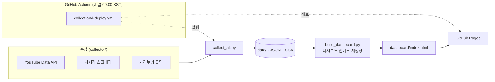

<div align="center">


# 🌟 StelLive Data Dashboard

**스텔라이브 멤버 데이터를 매일 자동 수집하고, 웹 대시보드로 시각화하는 데이터 제품**

<br/>

[](https://coding-jhj.github.io/Stelive_data/)


</div>

---

## ✨ 한눈에 보기

매일 새벽, 사람이 손대지 않아도 데이터가 수집되고 대시보드가 갱신됩니다. **수집 → 정제 → 저장 → 시각화 → 배포**의 전 과정을 GitHub Actions 하나로 자동화한 프로젝트입니다.

| 핵심 가치 | 구현 방식 |
|---|---|
| 🤖 완전 자동화 | GitHub Actions가 매일 09:00(KST) 수집 → 대시보드 재생성 → Pages 배포 |
| 🧊 데이터 동결 방지 | `build_dashboard.py`가 수집 데이터를 HTML에 임베드해 항상 최신 상태 유지 |
| 🔌 다중 소스 통합 | YouTube Data API + 치지직(CHZZK) 스크래핑 + 인기 키리누키 클립 |
| 📦 이력 축적 | 팔로워·구독자 추이를 CSV로 누적 저장해 시계열 분석 가능 |

---

## 🏗️ 아키텍처



---

## 📁 구조

```text
Stelive_data/
├── collect_all.py              # 전체 수집 실행 (엔트리포인트)
├── build_dashboard.py          # 수집 데이터로 대시보드 임베드 재생성 (동결 방지)
├── config.py                   # 멤버 설정 (채널 ID 포함)
├── requirements.txt
├── .env.example
├── collector/
│   ├── collect_youtube.py      # YouTube API 수집
│   ├── collect_chzzk.py        # 치지직 스크래핑
│   └── collect_kiriunuki.py    # 인기 키리누키 클립 수집
├── data/                       # 수집 데이터 (자동 생성)
│   ├── streams.json / .csv     # 방송 기록
│   ├── music.json / .csv       # 음악 발매
│   ├── collabs.json / .csv     # 콜라보 기록
│   ├── followers.csv           # 치지직 팔로워 추이
│   ├── subscribers.csv         # 유튜브 구독자 추이
│   ├── videos.json / .csv      # 유튜브 영상 전체
│   └── kiriunuki.json          # 인기 키리누키 클립
├── dashboard/
│   └── index.html              # 웹 대시보드
└── .github/workflows/
    └── collect-and-deploy.yml  # 매일 수집 → 임베드 재생성 → Pages 배포
```

---

## 🚀 설치 및 실행

```bash
# 1. 패키지 설치
pip install -r requirements.txt

# 2. API 키 설정
cp .env.example .env          # Windows: copy .env.example .env
#   .env 파일에 YOUTUBE_API_KEY 입력

# 3. 수집 실행
python collect_all.py

# 4. 대시보드 확인
#   dashboard/index.html 을 브라우저로 열기
```

---

## ⚙️ GitHub Actions 자동화 설정

1. `Settings → Secrets and variables → Actions → New repository secret`
   - Name: `YOUTUBE_API_KEY`
   - Value: 발급받은 키
2. `Settings → Pages → Source: GitHub Actions`

→ 매일 오전 9시(KST) **자동 수집 → 대시보드 임베드 재생성 → Pages 배포**

---

## 📊 대시보드 기능

- **홈** — 핵심 KPI · 오늘 방송 현황 · 주간 하이라이트
- **멤버** — 멤버별 상세 프로필 · 치지직/유튜브/트위터 링크
- **활동 분석** — 멤버별 성과 · 기수별 비교 · 카테고리 · 시간 흐름 · 팔로워 현황 · 인사이트
- **방송 기록** — 전체/멤버/카테고리/연도 필터 · 검색 · 정렬
- **키리누키** — 인기 팬 클립 Top 15 (조회수 순)
- **회사 소개** — 스텔라이브 소개

---

## 🧠 이 프로젝트로 보여주려는 것

- **데이터를 "제품"으로 만드는 전 과정** — 단발 스크립트가 아니라, 수집·정제·저장·시각화·배포가 반복 가능한 파이프라인으로 연결됨
- **운영 비용이 0인 자동화** — 서버 없이 GitHub Actions + Pages만으로 매일 돌아감
- **불안정한 외부 소스 다루기** — 공식 API(YouTube)와 비공식 스크래핑(치지직)을 함께 안정적으로 처리

---

## ⚠️ 주의사항

- `.env` 파일은 절대 커밋하지 마세요 (`.gitignore` 처리됨)
- YouTube API 무료 할당량: 하루 10,000 유닛
- 치지직은 비공식 API 사용 (정책 변경 시 동작이 달라질 수 있음)

---

<div align="center">


</div>
